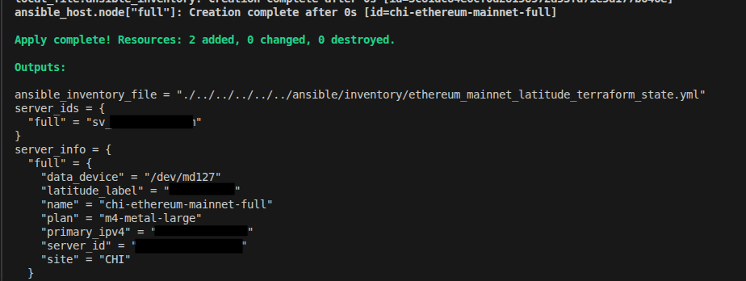
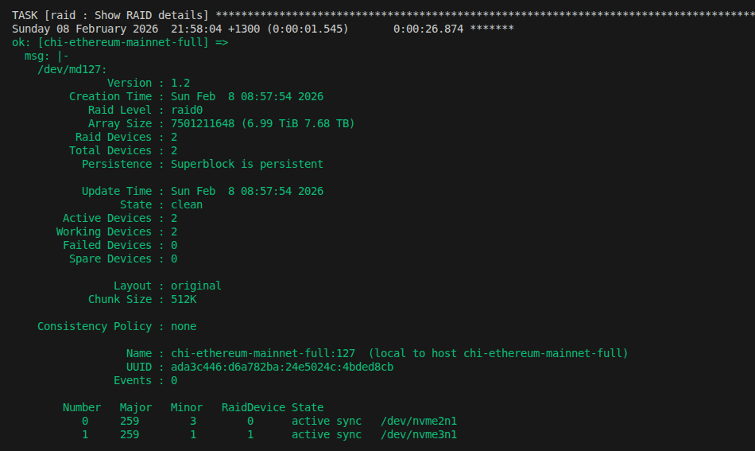
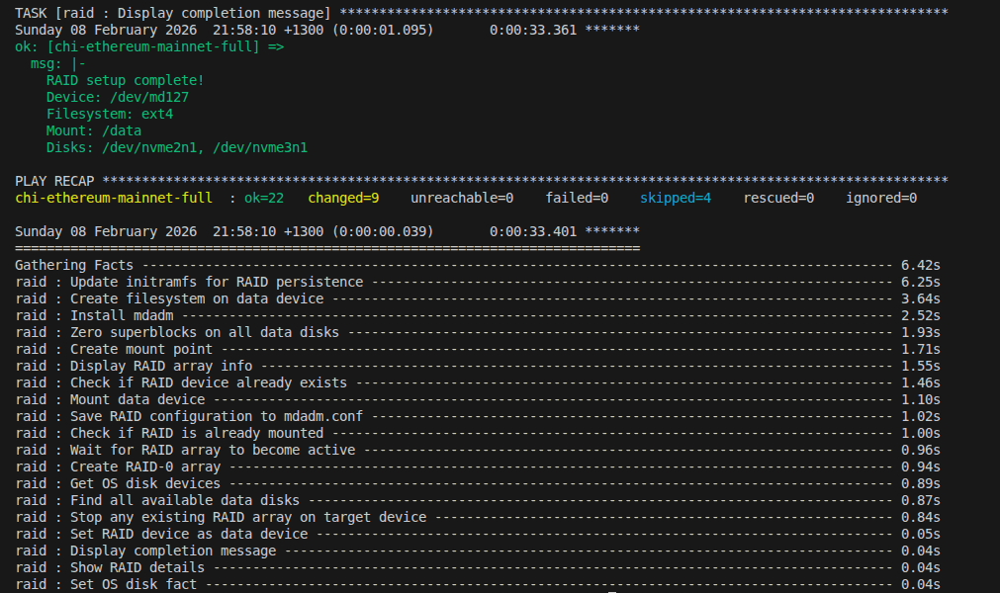
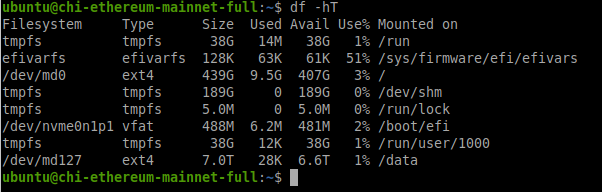

# Operations Guide

Operations guide for managing blockchain nodes. Covers both Docker deployments (Reth+Lighthouse, Geth+Prysm) and binary deployments (Erigon+Caplin) across Mainnet and Sepolia networks.

> **Initial deployment?** See the [Quick Start](../README.md#quick-start) in the README. For HAProxy vault setup, see [Ansible Vault Setup](ansible.md#ansible-vault-setup). For deployment scenarios, see [Deployment Scenarios](ansible.md#deployment-scenarios).

## Playbook Reference

Match the Ansible playbook to the `role` in your `nodes.tfvars`. If your inventory has mixed roles, run each playbook separately with `--limit`:

| `role` in nodes.tfvars | Playbook | Clients |
|------------------------|----------|---------|
| `ethereum` | `playbooks/ethereum.yml` | Docker: Geth+Prysm, Reth+Lighthouse |
| `erigon` | `playbooks/erigon.yml` | Binary: Erigon+Caplin |

```bash
cd ansible
export TF_TOKEN_app_terraform_io="your-api-token"
export ANSIBLE_PRIVATE_KEY_FILE=~/.ssh/your-key.pem

# Single role - all nodes same type
ansible-playbook -i inventory/ethereum_mainnet_aws_terraform_state.yml playbooks/erigon.yml

# Mixed roles - run each playbook with --limit
ansible-playbook -i inventory/ethereum_mainnet_aws_terraform_state.yml playbooks/ethereum.yml --limit node_full
ansible-playbook -i inventory/ethereum_mainnet_aws_terraform_state.yml playbooks/erigon.yml --limit node_archive

# Latitude BM - RAID first, then node playbook
ansible-playbook -i inventory/ethereum_mainnet_latitude_terraform_state.yml playbooks/raid.yml
ansible-playbook -i inventory/ethereum_mainnet_latitude_terraform_state.yml playbooks/erigon.yml
```

## Accessing Nodes

### SSH (VPN Allowlist)

```bash
ssh -i your-key.pem ubuntu@<instance-ip>
```

## Monitoring Sync Status

### Reth (Execution Layer)

```bash
# Check sync status
curl -s http://localhost:8545 \
  -X POST \
  -H "Content-Type: application/json" \
  -d '{"jsonrpc":"2.0","method":"eth_syncing","params":[],"id":1}' | jq

# Get current block
curl -s http://localhost:8545 \
  -X POST \
  -H "Content-Type: application/json" \
  -d '{"jsonrpc":"2.0","method":"eth_blockNumber","params":[],"id":1}' | jq

# Check peer count
curl -s http://localhost:8545 \
  -X POST \
  -H "Content-Type: application/json" \
  -d '{"jsonrpc":"2.0","method":"net_peerCount","params":[],"id":1}' | jq
```

### Lighthouse (Consensus Layer)

```bash
# Sync status
curl -s http://localhost:5052/eth/v1/node/syncing | jq

# Node health
curl -s http://localhost:5052/eth/v1/node/health

# Peer count
curl -s http://localhost:5052/eth/v1/node/peer_count | jq

# Node version
curl -s http://localhost:5052/eth/v1/node/version | jq
```

### Lighthouse Beacon API (L2 Beacon Endpoint)

Lighthouse archive nodes expose the Beacon API on port 5052 and serve as L1 beacon endpoints for L2 chains (Arbitrum, Optimism, Base, etc.) that require historical blob data.

```bash
# Get blob sidecars for a specific block (used by L2 chains)
curl -s http://localhost:5052/eth/v1/beacon/blob_sidecars/head | jq

# Get blob sidecars for a specific slot
curl -s http://localhost:5052/eth/v1/beacon/blob_sidecars/9000000 | jq

# Check finality
curl -s http://localhost:5052/eth/v1/beacon/states/finalized/finality_checkpoints | jq
```

Both mainnet and Sepolia Lighthouse archive nodes provide this endpoint. Archive flags (`--supernode`, `--prune-blobs=false`, `--prune-payloads=false`) ensure full blob retention.

### Erigon (Execution + Consensus)

Erigon nodes use the same JSON-RPC interface on port 8545:

```bash
# Check sync status
curl -s http://localhost:8545 \
  -X POST \
  -H "Content-Type: application/json" \
  -d '{"jsonrpc":"2.0","method":"eth_syncing","params":[],"id":1}' | jq

# Get current block
curl -s http://localhost:8545 \
  -X POST \
  -H "Content-Type: application/json" \
  -d '{"jsonrpc":"2.0","method":"eth_blockNumber","params":[],"id":1}' | jq

# Check peer count
curl -s http://localhost:8545 \
  -X POST \
  -H "Content-Type: application/json" \
  -d '{"jsonrpc":"2.0","method":"net_peerCount","params":[],"id":1}' | jq
```

### Remote Monitoring (via HAProxy)

Check sync status remotely using the HAProxy endpoint. API key can be passed via header or URL parameter:

```bash
# Method 1: API key via header
curl -s https://<domain>/ \
  -H "X-API-Key: <your-uuid>" \
  -X POST -H "Content-Type: application/json" \
  -d '{"jsonrpc":"2.0","method":"eth_syncing","params":[],"id":1}' | jq

# Method 2: API key via URL parameter
curl -s -X POST \
  -H "Content-Type: application/json" \
  -d '{"jsonrpc":"2.0","method":"eth_syncing","params":[],"id":1}' \
  "https://<domain>/?apikey=<your-uuid>" | jq
```

`eth_syncing` returns sync progress (`currentBlock`, `highestBlock`) while syncing, or `false` when fully synced.

**Continuous monitoring:** Use the [Block Lag Monitor](../tools/block-lag-monitor/) to track block lag, latency, and estimate sync ETA across all your nodes. Configure your HAProxy endpoints in `endpoints.json` and run the monitor to get real-time sync status.

## Service Management

### Docker Nodes (Reth+Lighthouse, Geth+Prysm)

```bash
# Status
sudo systemctl status ethereum

# Start/Stop/Restart
sudo systemctl start ethereum
sudo systemctl stop ethereum
sudo systemctl restart ethereum

# View logs
sudo journalctl -u ethereum -f
sudo journalctl -u ethereum --since "1 hour ago"
```

### Erigon Nodes (Erigon+Caplin, Binary Build)

```bash
# Status
sudo systemctl status erigon

# Start/Stop/Restart
sudo systemctl start erigon
sudo systemctl stop erigon
sudo systemctl restart erigon

# View logs
sudo journalctl -u erigon -f
sudo journalctl -u erigon --since "1 hour ago"

# Check binary version
/opt/erigon/build/bin/erigon --version

# Check installed version marker
cat /opt/erigon/.erigon_version
```

### HAProxy (Reverse Proxy)

```bash
# Status
sudo systemctl status haproxy

# Start/Stop/Restart
sudo systemctl start haproxy
sudo systemctl stop haproxy
sudo systemctl restart haproxy

# Reload (picks up config changes without dropping connections)
sudo systemctl reload haproxy

# View logs
sudo journalctl -u haproxy -f
sudo journalctl -u haproxy --since "1 hour ago"

# Validate config syntax
haproxy -c -f /etc/haproxy/haproxy.cfg

# Check TLS certificate
openssl x509 -in /etc/haproxy/ssl/haproxy.pem -noout -dates -subject

# Check certbot certificates
sudo certbot certificates

# Test renewal (dry run - auto-renewal runs via systemd timer every 12h)
sudo certbot renew --dry-run

# Force renewal (deploy hook rebuilds PEM + reloads HAProxy automatically)
sudo certbot renew --force-renewal

# HAProxy stats (if enabled, default localhost:8404)
curl -s http://127.0.0.1:8404/haproxy?stats
```

### Docker Commands (Docker Nodes Only)

```bash
cd /etc/ethereum/docker

# Container status
docker compose ps

# View logs
docker compose logs -f
docker compose logs -f reth
docker compose logs -f lighthouse

# Restart containers
docker compose restart
docker compose restart reth
docker compose restart lighthouse

# Resource usage
docker stats
```

## Upgrading Clients

### Docker Nodes (Reth+Lighthouse, Geth+Prysm)

#### 1. Update Version

Edit `ansible/inventory/group_vars/ethereum/main.yml`:

```yaml
reth_version: "v1.9.4"        # New version
lighthouse_version: "v8.0.0"  # New version
geth_version: "v1.16.8"       # New version
prysm_version: "v7.1.2"       # New version
```

#### 2. Run Ansible

```bash
cd ansible
export TF_TOKEN_app_terraform_io="your-api-token"

# Upgrade all mainnet Docker nodes (Reth+Lighthouse, Geth+Prysm)
ansible-playbook -i inventory/ethereum_mainnet_aws_terraform_state.yml playbooks/ethereum.yml

# Upgrade Sepolia Docker nodes (Geth+Prysm, Reth+Lighthouse)
ansible-playbook -i inventory/ethereum_sepolia_aws_terraform_state.yml playbooks/ethereum.yml

# Upgrade specific node group only
ansible-playbook -i inventory/ethereum_mainnet_aws_terraform_state.yml playbooks/ethereum.yml --limit node_full
ansible-playbook -i inventory/ethereum_mainnet_aws_terraform_state.yml playbooks/ethereum.yml --limit node_archive
```

#### 3. Verify

```bash
# Check container versions
docker compose ps
docker inspect reth | jq '.[0].Config.Image'
docker inspect lighthouse | jq '.[0].Config.Image'
```

### Erigon Nodes (Erigon+Caplin, Binary Build)

#### 1. Update Version

Edit `ansible/inventory/group_vars/erigon/main.yml`:

```yaml
erigon_version: "v3.3.7"  # New version (git tag from GitHub releases)
go_version: "1.25.7"      # Update if required by new Erigon version
```

#### 2. Run Ansible

The playbook detects the version mismatch via a marker file (`/opt/erigon/.erigon_version`), rebuilds Erigon from source, and restarts the service.

```bash
cd ansible
export TF_TOKEN_app_terraform_io="your-api-token"

# Upgrade mainnet Erigon nodes - AWS (rebuilds from source, ~5-10 min build time)
ansible-playbook -i inventory/ethereum_mainnet_aws_terraform_state.yml playbooks/erigon.yml

# Upgrade mainnet Erigon nodes - Latitude BM
ansible-playbook -i inventory/ethereum_mainnet_latitude_terraform_state.yml playbooks/erigon.yml

# Upgrade Sepolia Erigon nodes - AWS
ansible-playbook -i inventory/ethereum_sepolia_aws_terraform_state.yml playbooks/erigon.yml

# Upgrade Sepolia Erigon nodes - Latitude BM
ansible-playbook -i inventory/ethereum_sepolia_latitude_terraform_state.yml playbooks/erigon.yml

# Upgrade specific node type only
ansible-playbook -i inventory/ethereum_mainnet_aws_terraform_state.yml playbooks/erigon.yml --limit node_full
ansible-playbook -i inventory/ethereum_mainnet_aws_terraform_state.yml playbooks/erigon.yml --limit node_archive
```

#### 3. Verify

```bash
# Check service status
sudo systemctl status erigon

# Check version marker
cat /opt/erigon/.erigon_version

# Check sync status
curl -s http://localhost:8545 \
  -X POST \
  -H "Content-Type: application/json" \
  -d '{"jsonrpc":"2.0","method":"eth_syncing","params":[],"id":1}' | jq
```

## Disk Management

### Check Disk Usage

```bash
df -h /data
du -sh /data/*

# Docker nodes (Reth+Lighthouse or Geth+Prysm)
du -sh /data/reth/*
du -sh /data/lighthouse/*

# Erigon nodes (Erigon+Caplin)
du -sh /data/erigon/*
```

### Expand EBS Volume

1. Update `nodes.tfvars`:
   ```hcl
   archive = {
     # ...
     data_volume_size_gb = 6000  # New size
   }
   ```

2. Apply changes:
   ```bash
   # Mainnet
   cd terraform/stacks/aws/ethereum/mainnet
   terraform apply -var-file=nodes.tfvars

   # Sepolia
   cd terraform/stacks/aws/ethereum/sepolia
   terraform apply -var-file=nodes.tfvars
   ```

3. Resize filesystem on the instance:
   ```bash
   sudo growpart /dev/nvme1n1 1  # If partitioned
   sudo resize2fs /dev/nvme1n1   # ext4 resize
   ```

## Latitude Bare Metal Operations

### Deployment Screenshots

**Terraform Apply** - imports pre-ordered server and generates Ansible inventory:



**Ansible RAID-0 Setup** - auto-discovers data disks, creates `/dev/md127` RAID-0 array:



**RAID Setup Complete** - playbook summary and task timing:



**After Setup** - `/dev/md127` (7.0T ext4) mounted at `/data`:



### Why RAID-0 for Blockchain Nodes

Blockchain nodes are **write-heavy, I/O-intensive workloads** that benefit significantly from striped storage:

- **Sequential write throughput** scales linearly with the number of disks - critical during initial chain sync (days to weeks of continuous writes)
- **Random read IOPS** improve proportionally, benefiting state lookups and RPC query performance
- **Erigon, Reth, and Geth documentation** all recommend RAID-0 or NVMe storage for optimal sync and runtime performance
- **Archive nodes** (3-5+ TB) especially benefit since they perform heavy sequential I/O across large datasets

**Data protection tradeoff:** RAID-0 provides no redundancy - a single disk failure loses all data. This is acceptable for blockchain nodes because:

- Chain data can always be re-synced from the network (no unique data to lose)
- A full re-sync takes 2-14 days depending on node type, which is comparable to a RAID rebuild
- RAID-1/5/6 cut usable capacity and reduce write throughput, directly impacting sync performance
- For production uptime, run **multiple nodes across separate servers** rather than relying on disk-level redundancy

### RAID-0 Setup (Multiple Disks)

The RAID role auto-discovers unused data disks, excludes the OS disk (including RAID-1 root), and creates a RAID-0 array as `/dev/md127`. The `md127` device name avoids conflicts with Latitude's OS arrays (`md0`/`md1`).

```bash
cd ansible

# Setup RAID-0 on mainnet Latitude BM nodes
ansible-playbook -i inventory/ethereum_mainnet_latitude_terraform_state.yml playbooks/raid.yml

# Setup RAID-0 on Sepolia Latitude BM nodes
ansible-playbook -i inventory/ethereum_sepolia_latitude_terraform_state.yml playbooks/raid.yml

# Setup RAID on specific node only
ansible-playbook -i inventory/ethereum_mainnet_latitude_terraform_state.yml playbooks/raid.yml --limit node_full
```

If the BM has only 1 data disk, skip `raid.yml` - the common role handles single disks automatically.

### Check RAID Status

```bash
# RAID array status
cat /proc/mdstat
mdadm --detail /dev/md127

# Disk layout
lsblk

# Verify /data mount
df -hT /data
```

### OS Reinstall (Latitude Dashboard)

1. Reinstall OS via Latitude.sh dashboard (select Ubuntu 24.04, **no RAID** - Ansible handles RAID setup)
2. Rename hostname in Latitude console to match Terraform config (e.g., `chi-ethereum-mainnet-full`)
3. Wait for server status to change to **Active**
4. Re-run RAID setup and the appropriate playbook. Match the playbook to the node's `role` in `nodes.tfvars` (`ethereum` = Docker, `erigon` = binary):
   ```bash
   cd ansible

   # Step 1: RAID setup (if multiple disks)
   ansible-playbook -i inventory/ethereum_mainnet_latitude_terraform_state.yml playbooks/raid.yml --limit node_full

   # Step 2: Deploy node (pick ONE command that matches your role + network)
   # Mainnet - Docker full node (role = "ethereum"):
   ansible-playbook -i inventory/ethereum_mainnet_latitude_terraform_state.yml playbooks/ethereum.yml --limit node_full
   # Mainnet - Erigon full node (role = "erigon"):
   ansible-playbook -i inventory/ethereum_mainnet_latitude_terraform_state.yml playbooks/erigon.yml --limit node_full
   # Mainnet - Erigon archive node (role = "erigon"):
   ansible-playbook -i inventory/ethereum_mainnet_latitude_terraform_state.yml playbooks/erigon.yml --limit node_archive
   # Sepolia - Docker full node (role = "ethereum"):
   ansible-playbook -i inventory/ethereum_sepolia_latitude_terraform_state.yml playbooks/ethereum.yml --limit node_full
   # Sepolia - Erigon archive node (role = "erigon"):
   ansible-playbook -i inventory/ethereum_sepolia_latitude_terraform_state.yml playbooks/erigon.yml --limit node_archive
   ```
   No Terraform changes needed - server IP and ID remain the same after reinstall.

## Backup and Recovery

### Backup JWT Secret

```bash
# From the node
sudo cat /etc/ethereum/jwt.hex > jwt.hex.backup
```

### Database Pruning

Reth and Lighthouse handle pruning automatically in archive mode. For manual intervention:

```bash
# Stop services
sudo systemctl stop ethereum

# Reth has built-in pruning commands
docker run --rm -v /data/reth:/data ghcr.io/paradigmxyz/reth:latest \
  db stats --datadir /data

# Restart
sudo systemctl start ethereum
```

## Troubleshooting

### Node Not Syncing

1. Check container status:
   ```bash
   docker compose ps
   docker compose logs --tail 100
   ```

2. Verify P2P connectivity:
   ```bash
   # Check if P2P ports are open
   sudo ss -tlnp | grep -E '30303|9000'

   # Check peer counts
   curl -s http://localhost:8545 -X POST \
     -H "Content-Type: application/json" \
     -d '{"jsonrpc":"2.0","method":"net_peerCount","params":[],"id":1}'
   ```

3. Check disk space:
   ```bash
   df -h /data
   ```

### Checkpoint Sync Failures (Lighthouse)

Lighthouse v8.0.0+ requires blob serving from checkpoint sync endpoints for post-Deneb finalized states. If checkpoint sync fails with `Error fetching finalized blobs from remote`:

1. **Sepolia:** Standard endpoints (`beaconstate.info`, `ethpandaops.io`, `chainsafe.io`) do not serve blobs. Use the Nimbus endpoint: `http://unstable.sepolia.beacon-api.nimbus.team` (configured in `group_vars/network_sepolia/main.yml`).

2. **If the Nimbus endpoint is also down:** Remove checkpoint sync and sync from genesis:
   ```bash
   # On the server: remove checkpoint-sync-url from docker-compose.yml, wipe data, restart
   cd /etc/ethereum/docker
   docker compose down -t 90
   rm -rf /data/lighthouse/*
   # Edit docker-compose.yml: remove --checkpoint-sync-url and --checkpoint-sync-url-timeout lines
   docker compose up -d
   ```
   Or set `checkpoint_sync_url: ""` in `group_vars/network_sepolia/main.yml` and re-run the playbook.

3. **Mainnet:** Uses `https://mainnet.checkpoint.sigp.io` (Sigma Prime, stable). Should work reliably.

### Firewall Issues (Erigon / Latitude BM)

```bash
# Check UFW status and rules
sudo ufw status verbose

# Check if specific port is open
sudo ufw status | grep 30303

# Test RPC locally (binds to 127.0.0.1 - external access via HAProxy 443)
curl -s http://localhost:8545 -X POST \
  -H "Content-Type: application/json" \
  -d '{"jsonrpc":"2.0","method":"eth_blockNumber","params":[],"id":1}'

# Add a new VPN IP (temporary, prefer group_vars + playbook)
sudo ufw allow from 203.0.113.10/32 comment "VPN egress"

# Re-apply firewall rules from Ansible (mainnet)
cd ansible
ansible-playbook -i inventory/ethereum_mainnet_latitude_terraform_state.yml playbooks/erigon.yml --tags firewall

# Re-apply firewall rules from Ansible (Sepolia)
ansible-playbook -i inventory/ethereum_sepolia_latitude_terraform_state.yml playbooks/erigon.yml --tags firewall
```

### HAProxy Issues

**TLS certificate not working:**
```bash
# Check certificate details
openssl x509 -in /etc/haproxy/ssl/haproxy.pem -noout -dates -subject

# Check certbot status
sudo certbot certificates

# If cert is expired, force renewal
sudo certbot renew --force-renewal

# Rebuild PEM bundle and reload HAProxy
cat /etc/letsencrypt/live/<domain>/fullchain.pem \
    /etc/letsencrypt/live/<domain>/privkey.pem \
    > /etc/haproxy/ssl/haproxy.pem
chmod 600 /etc/haproxy/ssl/haproxy.pem
sudo systemctl reload haproxy
```

**Certbot DNS-01 validation failing:**
```bash
# Check AWS credentials (BM only)
cat /root/.aws/credentials

# Test Route 53 access
aws route53 list-hosted-zones

# Check certbot logs
sudo journalctl -u certbot -f
cat /var/log/letsencrypt/letsencrypt.log
```

**API key rejected (403):**
```bash
# Check API key file exists and has correct content
cat /etc/haproxy/api-keys/api.key

# Test with header
curl -v https://<domain>/ -H "X-API-Key: <your-uuid>"

# Test with URL parameter
curl -v "https://<domain>/?apikey=<your-uuid>"

# Check HAProxy config references the correct file
grep api-key /etc/haproxy/haproxy.cfg
```

**WebSocket connections failing:**
```bash
# Test WS upgrade
wscat -c wss://<domain>/ -H "X-API-Key: <your-uuid>"

# Check HAProxy logs for WS upgrade issues
sudo journalctl -u haproxy | grep -i websocket
```

**Re-deploy HAProxy config from Ansible:**
```bash
cd ansible

# Re-apply HAProxy only (AWS)
ansible-playbook -i inventory/ethereum_mainnet_aws_terraform_state.yml playbooks/erigon.yml --tags haproxy

# Re-apply HAProxy only (Latitude BM)
ansible-playbook -i inventory/ethereum_mainnet_latitude_terraform_state.yml playbooks/erigon.yml --tags haproxy
```

### Engine API Issues

Lighthouse can't connect to Reth:

```bash
# Check Engine API is accessible
curl -s http://localhost:8551 2>&1 || echo "Connection failed"

# Verify JWT secret matches
docker compose exec reth cat /jwt.hex
docker compose exec lighthouse cat /jwt.hex
```

### High Memory Usage

```bash
# Check container memory
docker stats --no-stream

# If needed, add memory limits to docker-compose.yml:
# services:
#   reth:
#     deploy:
#       resources:
#         limits:
#           memory: 24G
```

### Container Restart Loop

```bash
# Check exit reason
docker compose logs --tail 50 reth
docker compose logs --tail 50 lighthouse

# Common causes:
# - Disk full
# - Corrupted database
# - Wrong configuration
```

## Security Checklist

### All Nodes
- [ ] SSH allowlist restricted to VPN egress IPs
- [ ] JWT secret securely generated
- [ ] Regular security updates applied

### AWS (Security Groups)
- [ ] Security groups restrict SSH to VPN CIDRs only
- [ ] P2P ports open to necessary CIDRs
- [ ] No public IP on instance (use EIP if needed)
- [ ] IMDSv2 required (no IMDSv1)

### Latitude BM (UFW Firewall)
- [ ] UFW enabled via `group_vars/platform_latitude/main.yml` (disabled on AWS - Security Groups handle it)
- [ ] VPN IPs configured in `erigon_firewall_allowed_ips`
  - Mainnet: `group_vars/erigon/main.yml`
  - Sepolia: `group_vars/network_sepolia/main.yml`
- [ ] RPC (8545, 8546) bound to `127.0.0.1` only (external access via HAProxy 443)
- [ ] Engine API (8551), gRPC (9090) accessible only from VPN IPs
- [ ] Public ports verified: P2P (30303-30304), Torrent (42069), Caplin (4000-4001), DNS (53)
- [ ] HAProxy ports (80, 443) open when `haproxy_firewall_enabled: true`
- [ ] `ufw status` on server shows expected rules

### HAProxy (TLS + API Key Auth)
- [ ] `haproxy_domain` set to a valid domain with Route 53 hosted zone
- [ ] `haproxy_certbot_email` set for Let's Encrypt notifications
- [ ] TLS certificate valid: `openssl x509 -in /etc/haproxy/ssl/haproxy.pem -noout -dates`
- [ ] Certbot auto-renewal working: `sudo certbot renew --dry-run`
- [ ] API key file permissions correct: `ls -la /etc/haproxy/api-keys/api.key` (owner: haproxy, mode 0640)
- [ ] RPC returns 403 without API key: `curl -s https://<domain>/`
- [ ] RPC works with API key: `curl -s https://<domain>/ -H "X-API-Key: <uuid>"`
- [ ] Stats page not publicly accessible (bound to 127.0.0.1 by default)

### Ansible Vault (Secrets Management)
- [ ] Vault password file exists: `ls -la ansible/.vault_password` (mode 0600)
- [ ] Vault password file is gitignored (`.vault_password` in `.gitignore`)
- [ ] Per-role vaults encrypted: `ansible-vault view inventory/group_vars/erigon/vault.yml`
- [ ] Per-role vaults encrypted: `ansible-vault view inventory/group_vars/ethereum/vault.yml`
- [ ] API keys are per-role (different UUID4 in each vault, not shared)
- [ ] Stats passwords stored in per-role vaults (not plaintext)
- [ ] No plaintext secrets in `group_vars/*/main.yml` files
- [ ] Latitude BM: AWS credentials in vault: `group_vars/platform_latitude/vault.yml`
- [ ] Vault password not stored in version control or shared insecurely

## Emergency Procedures

### Force Stop (Docker Nodes - Reth+Lighthouse, Geth+Prysm)

```bash
docker compose down
# or
docker kill $(docker ps -q)
```

### Force Stop (Erigon Nodes - Erigon+Caplin)

```bash
sudo systemctl stop erigon
```

### Start Fresh (Data Loss Warning)

**Docker nodes (Reth+Lighthouse, Geth+Prysm):**
```bash
sudo systemctl stop ethereum
sudo rm -rf /data/reth/*
sudo rm -rf /data/lighthouse/*
# Keep JWT: /etc/ethereum/jwt.hex
sudo systemctl start ethereum
```

**Erigon nodes (Erigon+Caplin):**
```bash
sudo systemctl stop erigon
sudo rm -rf /data/erigon/datadir/*
# Keep JWT: /etc/ethereum/jwt.hex
sudo systemctl start erigon
```

### Rollback to Previous Version

**Docker nodes (Reth+Lighthouse, Geth+Prysm):**
```bash
# Update client versions in ansible/inventory/group_vars/ethereum/main.yml, then:
cd ansible
export TF_TOKEN_app_terraform_io="your-api-token"
ansible-playbook -i inventory/ethereum_mainnet_aws_terraform_state.yml playbooks/ethereum.yml
```

**Erigon nodes (Erigon+Caplin):**
```bash
# Update erigon_version in ansible/inventory/group_vars/erigon/main.yml, then:
cd ansible
export TF_TOKEN_app_terraform_io="your-api-token"

# Mainnet - AWS
ansible-playbook -i inventory/ethereum_mainnet_aws_terraform_state.yml playbooks/erigon.yml

# Mainnet - Latitude BM
ansible-playbook -i inventory/ethereum_mainnet_latitude_terraform_state.yml playbooks/erigon.yml

# Sepolia - AWS
ansible-playbook -i inventory/ethereum_sepolia_aws_terraform_state.yml playbooks/erigon.yml

# Sepolia - Latitude BM
ansible-playbook -i inventory/ethereum_sepolia_latitude_terraform_state.yml playbooks/erigon.yml
# Playbook detects version mismatch, rebuilds from source, restarts service
```
